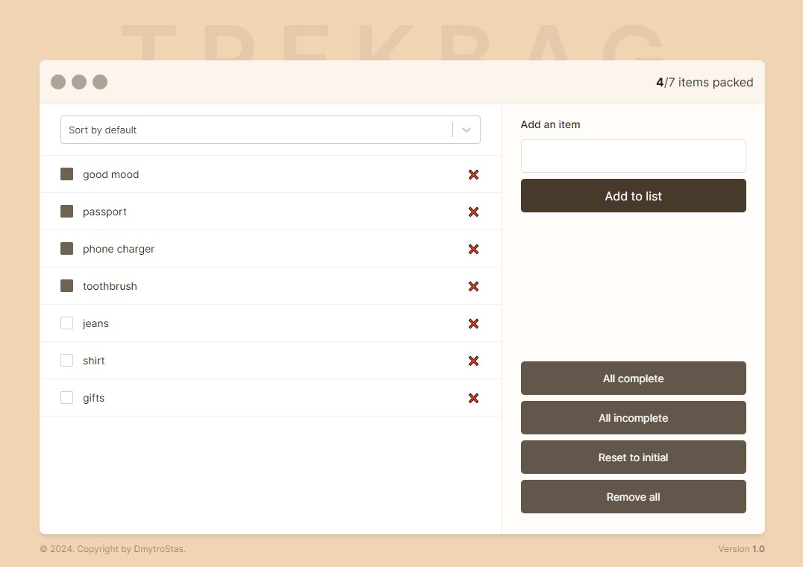

# TrekBag

## Overview

Individual project

TrekBag is a simple, convenient and useful application that won't let you forget the things you need for your trip. Add, remove, mark, sort and reset your list - it's all about TrekBag

## Features

- Saving data to local storage
- Zustand store implemented
- Responsive design for optimal viewing on different devices

## Technologies Used

##

> Developed by Dmytro Stas

